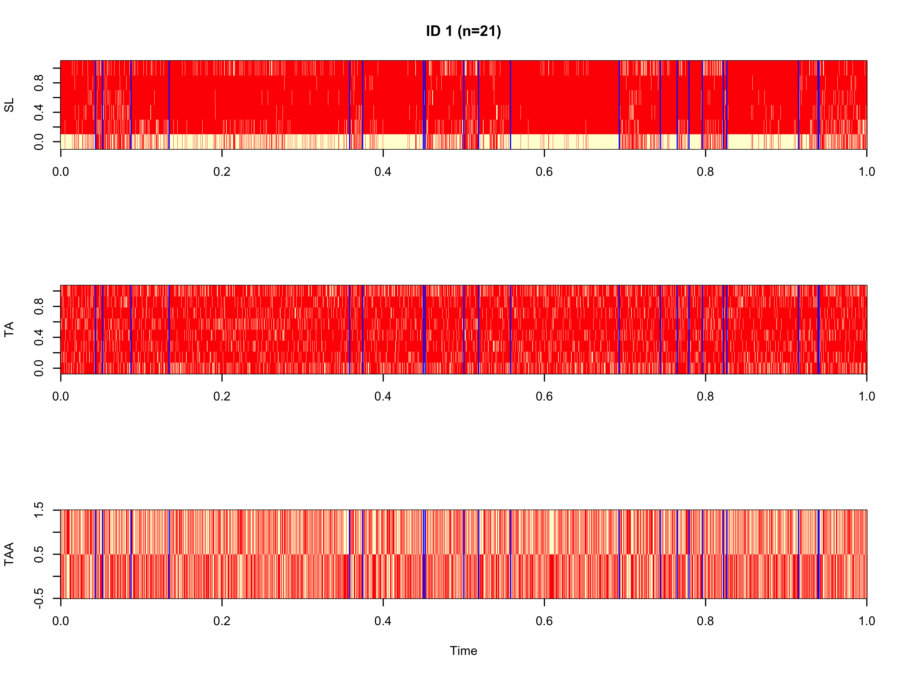
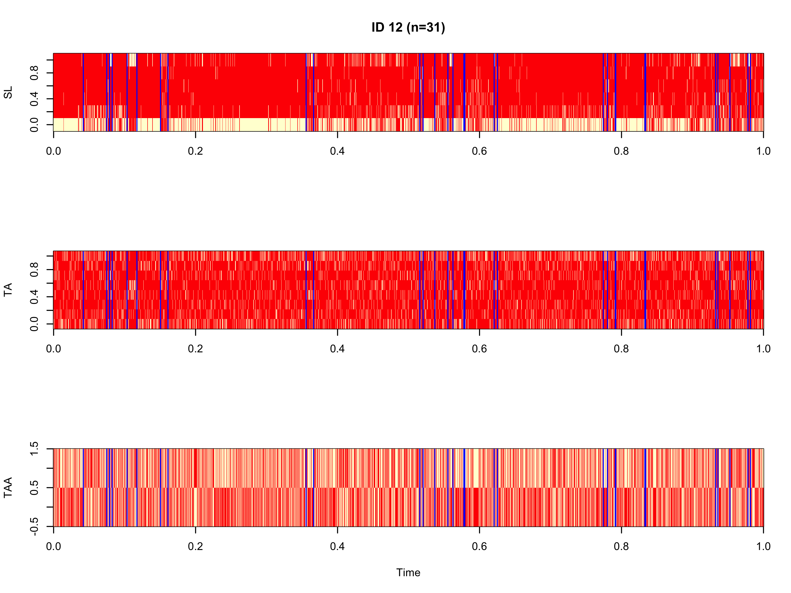
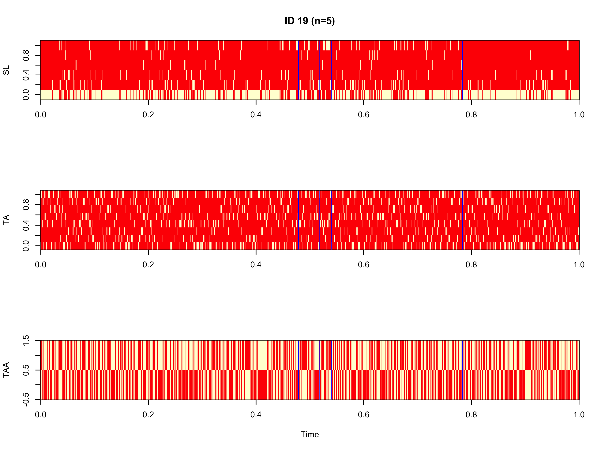
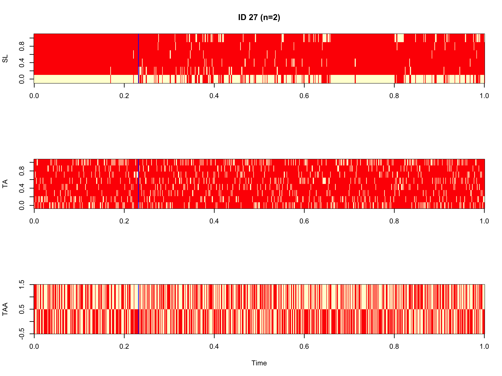

```{r setup, include=FALSE}
knitr::opts_chunk$set(echo = FALSE, warning = FALSE, message = FALSE)
```

# Background

After running the time segmentation model, a behavior segmentation model was run for the entire dataset of each individual. The behavior segmentation model uses three movement parameters (step length, turning angle, and turning angle autocorrelation) to identify distinct behavioral states.  


Additionally, the segmentation of behaviors was mapped to discern if the models characterized behavioral changes appropriately. This was conducted for each of the four individual snail kites. All models were analyzed on only data that were filtered for a time step of 1 h (3600 s); a quick analysis showed that a 1 h time step produces the greatest number of total observations.


# Behavior Segmentation

All of the behavior segmentation models analyzed with the original variables (SL,TA,TAA) were run using 50000 iterations. Additional model output (# of breakpoints, log marginal likelihood) was also evaluated with traceplots, but are not included in this document. Based upon the traceplots of these variables however, it appears that a greater number of iterations is likely not needed.

```{r, load packages}
library(knitr)
library(dplyr)
library(ggplot2)
library(rnaturalearth)
library(rnaturalearthdata)
library(sf)
library(cowplot)
```


### ID 1
```{r, out.width='80%', fig.align='center'}

```

### ID 12
```{r, out.width='80%', fig.align='center'}

```

### ID 19
```{r, out.width='80%', fig.align='center'}

```

### ID 27
```{r, out.width='80%', fig.align='center'}

```


# Mapping the Model Output

```{r}
source('helper functions.R')

dat<- read.csv("Snail Kite Gridded Data.csv", header = T, sep = ",")
names(dat)[7]<- "dist"  #change to generic form
behav.list<- behav.prep(dat=dat, tstep = 3600)  #add move params and filter by 3600 s interval
```


Some of the following behavioral segments appear to match up well with movement patterns, while others appear to be aggregated. This also varies by individual and the duration of the track. For example, **ID 12** has 31 estimated behavioral segments, whereas **ID 27** only has 2.

```{r load map data}
#Load FL map data
usa <- ne_states(country = "United States of America", returnclass = "sf")
fl<- usa %>% filter(name == "Florida")
fl<- st_transform(fl, crs = "+init=epsg:32617") #change projection to UTM 17N
```

```{r behavior segmentation}
obs1.breakpts_orig<- read.csv("ID1 Breakpoints (Behavior).csv", header = T, sep = ",")
obs1.breakpts_orig=obs1.breakpts_orig[,1]
obs12.breakpts_orig<- read.csv("ID12 Breakpoints (Behavior).csv", header = T, sep = ",")
obs12.breakpts_orig=obs12.breakpts_orig[,1]
obs19.breakpts_orig<- read.csv("ID19 Breakpoints (Behavior).csv", header = T, sep = ",")
obs19.breakpts_orig=obs19.breakpts_orig[,1]
obs27.breakpts_orig<- read.csv("ID27 Breakpoints (Behavior).csv", header = T, sep = ",")
obs27.breakpts_orig=obs27.breakpts_orig[,1]


assign.behav.seg=function(breakpt,dat){
  breakpt1=c(0,breakpt,Inf)
  n=length(breakpt1)
  dat$behav.seg<- NA
  
  for (i in 2:n){
    ind=which(breakpt1[i-1]<dat$time1 & dat$time1<breakpt1[i])
    dat[ind,"behav.seg"]=i-1
  }
  dat
}


dat1<- assign.behav.seg(obs1.breakpts_orig, behav.list$`1`)
dat12<- assign.behav.seg(obs12.breakpts_orig, behav.list$`12`)
dat19<- assign.behav.seg(obs19.breakpts_orig, behav.list$`19`)
dat27<- assign.behav.seg(obs27.breakpts_orig, behav.list$`27`)

dat1.full<-  dat %>% filter(id==1)
dat12.full<-  dat %>% filter(id==12)
dat19.full<-  dat %>% filter(id==19)
dat27.full<-  dat %>% filter(id==27)
```


```{r map ID 1 orig, fig.align="center"}
ggplot() +
  geom_sf(data = fl) +
  coord_sf(xlim = c(min(dat$utmlong-20000), max(dat$utmlong+20000)),
           ylim = c(min(dat$utmlat-20000), max(dat$utmlat+20000)), expand = FALSE) +
  geom_path(data = dat1.full, aes(x=utmlong, y=utmlat), color="gray60", size=0.25) +
  geom_point(data = dat1.full, aes(x=utmlong, y=utmlat), color='gray75', size=1) +
  geom_point(data = dat1, aes(utmlong, utmlat, color=behav.seg), size=1) +
  scale_color_viridis_c("Behavioral Segment") +
  labs(x = "Easting", y = "Northing", title = "ID 1 (n=26)") +
  theme_bw()
```

```{r map ID 1 orig facet, fig.align="center"}
ggplot() +
  geom_sf(data = fl) +
  coord_sf(xlim = c(min(dat$utmlong-20000), max(dat$utmlong+20000)),
           ylim = c(min(dat$utmlat-20000), max(dat$utmlat+20000)), expand = FALSE) +
  geom_point(data = dat1, aes(utmlong, utmlat, color=behav.seg), size=1) +
  scale_color_viridis_c("Behavioral Segment") +
  labs(x = "Easting", y = "Northing", title = "ID 1 (n=26)") +
  theme_bw() +
  facet_wrap(~behav.seg, nrow = 3)
```


```{r map ID 12 orig, fig.align="center"}
ggplot() +
  geom_sf(data = fl) +
  coord_sf(xlim = c(min(dat$utmlong-20000), max(dat$utmlong+20000)),
           ylim = c(min(dat$utmlat-20000), max(dat$utmlat+20000)), expand = FALSE) +
  geom_path(data = dat12.full, aes(x=utmlong, y=utmlat), color="gray60", size=0.25) +
  geom_point(data = dat12.full, aes(x=utmlong, y=utmlat), color='gray75', size=1) +
  geom_point(data = dat12, aes(utmlong, utmlat, color=behav.seg), size=1) +
  scale_color_viridis_c("Behavioral Segment") +
  labs(x = "Easting", y = "Northing", title = "ID 12 (n=31)") +
  theme_bw()
```

```{r map ID 12 orig facet, fig.align="center"}
ggplot() +
  geom_sf(data = fl) +
  coord_sf(xlim = c(min(dat$utmlong-20000), max(dat$utmlong+20000)),
           ylim = c(min(dat$utmlat-20000), max(dat$utmlat+20000)), expand = FALSE) +
  geom_point(data = dat12, aes(utmlong, utmlat, color=behav.seg), size=1) +
  scale_color_viridis_c("Behavioral Segment") +
  labs(x = "Easting", y = "Northing", title = "ID 12 (n=31)") +
  theme_bw() +
  facet_wrap(~behav.seg, nrow = 3)
```


```{r map ID 19 orig, fig.align="center"}
ggplot() +
  geom_sf(data = fl) +
  coord_sf(xlim = c(min(dat$utmlong-20000), max(dat$utmlong+20000)),
           ylim = c(min(dat$utmlat-20000), max(dat$utmlat+20000)), expand = FALSE) +
  geom_path(data = dat19.full, aes(x=utmlong, y=utmlat), color="gray60", size=0.25) +
  geom_point(data = dat19.full, aes(x=utmlong, y=utmlat), color='gray75', size=1) +
  geom_point(data = dat19, aes(utmlong, utmlat, color=behav.seg), size=1) +
  scale_color_viridis_c("Behavioral Segment") +
  labs(x = "Easting", y = "Northing", title = "ID 19 (n=5)") +
  theme_bw()
```

```{r map ID 19 orig facet, fig.align="center"}
ggplot() +
  geom_sf(data = fl) +
  coord_sf(xlim = c(min(dat$utmlong-20000), max(dat$utmlong+20000)),
           ylim = c(min(dat$utmlat-20000), max(dat$utmlat+20000)), expand = FALSE) +
  geom_point(data = dat19, aes(utmlong, utmlat, color=behav.seg), size=1) +
  scale_color_viridis_c("Behavioral Segment") +
  labs(x = "Easting", y = "Northing", title = "ID 19 (n=5)") +
  theme_bw() +
  facet_wrap(~behav.seg, nrow = 1)
```


```{r map ID 27 orig, fig.align="center"}
ggplot() +
  geom_sf(data = fl) +
  coord_sf(xlim = c(min(dat$utmlong-20000), max(dat$utmlong+20000)),
           ylim = c(min(dat$utmlat-20000), max(dat$utmlat+20000)), expand = FALSE) +
  geom_path(data = dat27.full, aes(x=utmlong, y=utmlat), color="gray60", size=0.25) +
  geom_point(data = dat27.full, aes(x=utmlong, y=utmlat), color='gray75', size=1) +
  geom_point(data = dat27, aes(utmlong, utmlat, color=behav.seg), size=1) +
  scale_color_viridis_c("Behavioral Segment") +
  labs(x = "Easting", y = "Northing", title = "ID 27 (n=2)") +
  theme_bw()
```

```{r map ID 27 orig facet, fig.align="center"}
ggplot() +
  geom_sf(data = fl) +
  coord_sf(xlim = c(min(dat$utmlong-20000), max(dat$utmlong+20000)),
           ylim = c(min(dat$utmlat-20000), max(dat$utmlat+20000)), expand = FALSE) +
  geom_point(data = dat27, aes(utmlong, utmlat, color=behav.seg), size=1) +
  scale_color_viridis_c("Behavioral Segment") +
  labs(x = "Easting", y = "Northing", title = "ID 27 (n=2)") +
  theme_bw() +
  facet_wrap(~behav.seg, nrow = 1)
```


# Visualizing Distributions of Movement Parameters Among Time Segments

### ID 1
```{r, fig.height=7}
#Segments 1-9
SL.hist<- ggplot(data = dat1[dat1$behav.seg <= 9,]) +
          geom_histogram(aes(x=SL)) +
          facet_wrap(~behav.seg, scales = 'free_y', ncol = 1) +
          theme_bw()

TA.hist<- ggplot(data = dat1[dat1$behav.seg <= 9,]) +
          geom_histogram(aes(x=TA)) +
          facet_wrap(~behav.seg, scales = 'free_y', ncol = 1) +
          theme_bw()

TAA.hist<- ggplot(data = dat1[dat1$behav.seg <= 9,]) +
          geom_histogram(aes(x=TAA)) +
          facet_wrap(~behav.seg, scales = 'free_y', ncol = 1) +
          theme_bw()

plot_grid(SL.hist,TA.hist,TAA.hist, ncol = 3, labels = "")

#Segments 9-17
SL.hist<- ggplot(data = dat1[dat1$behav.seg > 9 & dat1$behav.seg <= 17,]) +
          geom_histogram(aes(x=SL)) +
          facet_wrap(~behav.seg, scales = 'free_y', ncol = 1) +
          theme_bw()

TA.hist<- ggplot(data = dat1[dat1$behav.seg > 9 & dat1$behav.seg <= 17,]) +
          geom_histogram(aes(x=TA)) +
          facet_wrap(~behav.seg, scales = 'free_y', ncol = 1) +
          theme_bw()

TAA.hist<- ggplot(data = dat1[dat1$behav.seg > 9 & dat1$behav.seg <= 17,]) +
          geom_histogram(aes(x=TAA)) +
          facet_wrap(~behav.seg, scales = 'free_y', ncol = 1) +
          theme_bw()

plot_grid(SL.hist,TA.hist,TAA.hist, ncol = 3, labels = "")

#Segments 18-26
SL.hist<- ggplot(data = dat1[dat1$behav.seg > 17,]) +
          geom_histogram(aes(x=SL)) +
          facet_wrap(~behav.seg, scales = 'free_y', ncol = 1) +
          theme_bw()

TA.hist<- ggplot(data = dat1[dat1$behav.seg > 17,]) +
          geom_histogram(aes(x=TA)) +
          facet_wrap(~behav.seg, scales = 'free_y', ncol = 1) +
          theme_bw()

TAA.hist<- ggplot(data = dat1[dat1$behav.seg > 17,]) +
          geom_histogram(aes(x=TAA)) +
          facet_wrap(~behav.seg, scales = 'free_y', ncol = 1) +
          theme_bw()

plot_grid(SL.hist,TA.hist,TAA.hist, ncol = 3, labels = "")
```


### ID 12
```{r, fig.height=7}
#Segments 1-9
SL.hist<- ggplot(data = dat12[dat12$behav.seg <= 9,]) +
          geom_histogram(aes(x=SL)) +
          facet_wrap(~behav.seg, scales = 'free_y', ncol = 1) +
          theme_bw()

TA.hist<- ggplot(data = dat12[dat12$behav.seg <= 9,]) +
          geom_histogram(aes(x=TA)) +
          facet_wrap(~behav.seg, scales = 'free_y', ncol = 1) +
          theme_bw()

TAA.hist<- ggplot(data = dat12[dat12$behav.seg <= 9,]) +
          geom_histogram(aes(x=TAA)) +
          facet_wrap(~behav.seg, scales = 'free_y', ncol = 1) +
          theme_bw()

plot_grid(SL.hist,TA.hist,TAA.hist, ncol = 3, labels = "")

#Segments 9-17
SL.hist<- ggplot(data = dat12[dat12$behav.seg > 9 & dat12$behav.seg <= 17,]) +
          geom_histogram(aes(x=SL)) +
          facet_wrap(~behav.seg, scales = 'free_y', ncol = 1) +
          theme_bw()

TA.hist<- ggplot(data = dat12[dat12$behav.seg > 9 & dat12$behav.seg <= 17,]) +
          geom_histogram(aes(x=TA)) +
          facet_wrap(~behav.seg, scales = 'free_y', ncol = 1) +
          theme_bw()

TAA.hist<- ggplot(data = dat12[dat12$behav.seg > 9 & dat12$behav.seg <= 17,]) +
          geom_histogram(aes(x=TAA)) +
          facet_wrap(~behav.seg, scales = 'free_y', ncol = 1) +
          theme_bw()

plot_grid(SL.hist,TA.hist,TAA.hist, ncol = 3, labels = "")

#Segments 18-25
SL.hist<- ggplot(data = dat12[dat12$behav.seg > 17 & dat12$behav.seg <= 25,]) +
          geom_histogram(aes(x=SL)) +
          facet_wrap(~behav.seg, scales = 'free_y', ncol = 1) +
          theme_bw()

TA.hist<- ggplot(data = dat12[dat12$behav.seg > 17 & dat12$behav.seg <= 25,]) +
          geom_histogram(aes(x=TA)) +
          facet_wrap(~behav.seg, scales = 'free_y', ncol = 1) +
          theme_bw()

TAA.hist<- ggplot(data = dat12[dat12$behav.seg > 17 & dat12$behav.seg <= 25,]) +
          geom_histogram(aes(x=TAA)) +
          facet_wrap(~behav.seg, scales = 'free_y', ncol = 1) +
          theme_bw()

plot_grid(SL.hist,TA.hist,TAA.hist, ncol = 3, labels = "")

#Segments 26-31
SL.hist<- ggplot(data = dat12[dat12$behav.seg > 25,]) +
          geom_histogram(aes(x=SL)) +
          facet_wrap(~behav.seg, scales = 'free_y', ncol = 1) +
          theme_bw()

TA.hist<- ggplot(data = dat12[dat12$behav.seg > 25,]) +
          geom_histogram(aes(x=TA)) +
          facet_wrap(~behav.seg, scales = 'free_y', ncol = 1) +
          theme_bw()

TAA.hist<- ggplot(data = dat12[dat12$behav.seg > 25,]) +
          geom_histogram(aes(x=TAA)) +
          facet_wrap(~behav.seg, scales = 'free_y', ncol = 1) +
          theme_bw()

plot_grid(SL.hist,TA.hist,TAA.hist, ncol = 3, labels = "")
```

### ID 19
```{r, fig.height=7}
#Segments 1-5
SL.hist<- ggplot(data = dat19) +
          geom_histogram(aes(x=SL)) +
          facet_wrap(~behav.seg, scales = 'free_y', ncol = 1) +
          theme_bw()

TA.hist<- ggplot(data = dat19) +
          geom_histogram(aes(x=TA)) +
          facet_wrap(~behav.seg, scales = 'free_y', ncol = 1) +
          theme_bw()

TAA.hist<- ggplot(data = dat19) +
          geom_histogram(aes(x=TAA)) +
          facet_wrap(~behav.seg, scales = 'free_y', ncol = 1) +
          theme_bw()

plot_grid(SL.hist,TA.hist,TAA.hist, ncol = 3, labels = "")

```

### ID 27
```{r}
#Segments 1-2
SL.hist<- ggplot(data = dat27) +
          geom_histogram(aes(x=SL)) +
          facet_wrap(~behav.seg, scales = 'free_y', ncol = 1) +
          theme_bw()

TA.hist<- ggplot(data = dat27) +
          geom_histogram(aes(x=TA)) +
          facet_wrap(~behav.seg, scales = 'free_y', ncol = 1) +
          theme_bw()

TAA.hist<- ggplot(data = dat27) +
          geom_histogram(aes(x=TAA)) +
          facet_wrap(~behav.seg, scales = 'free_y', ncol = 1) +
          theme_bw()

plot_grid(SL.hist,TA.hist,TAA.hist, ncol = 3, labels = "")

```