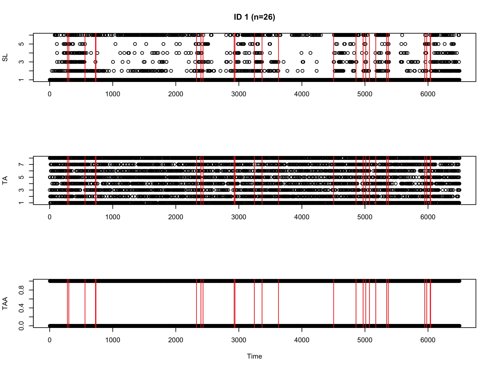
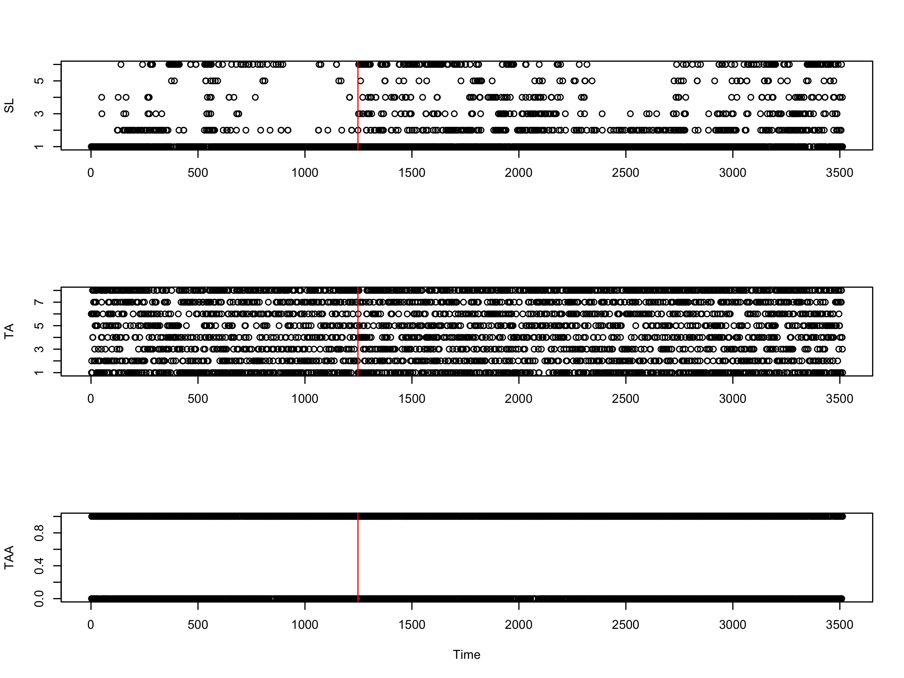
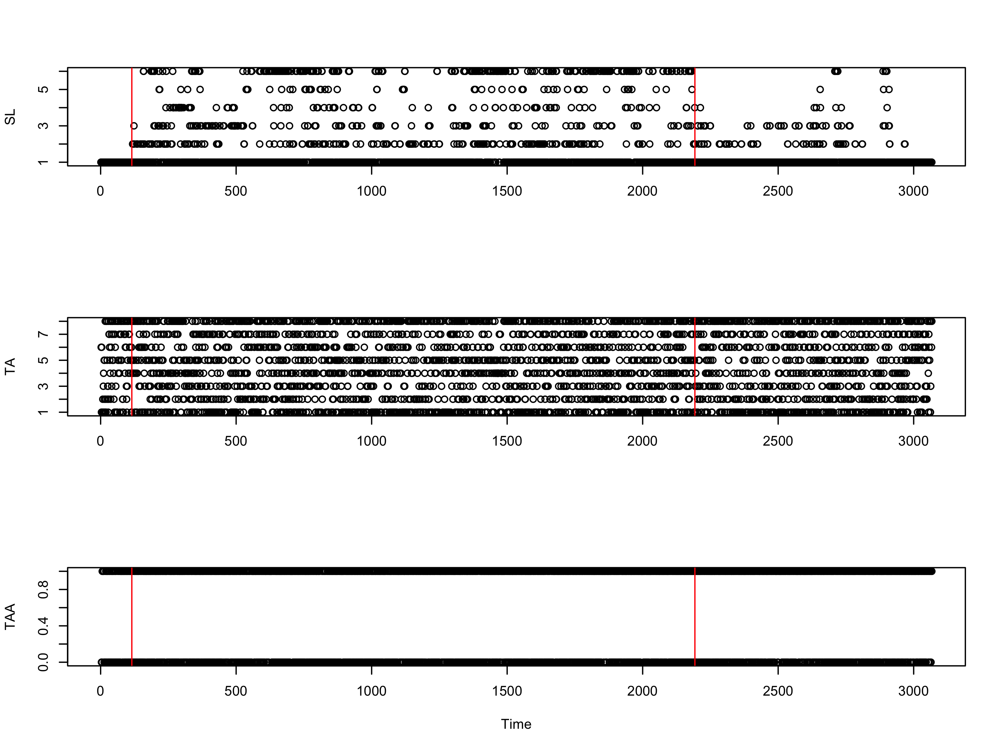
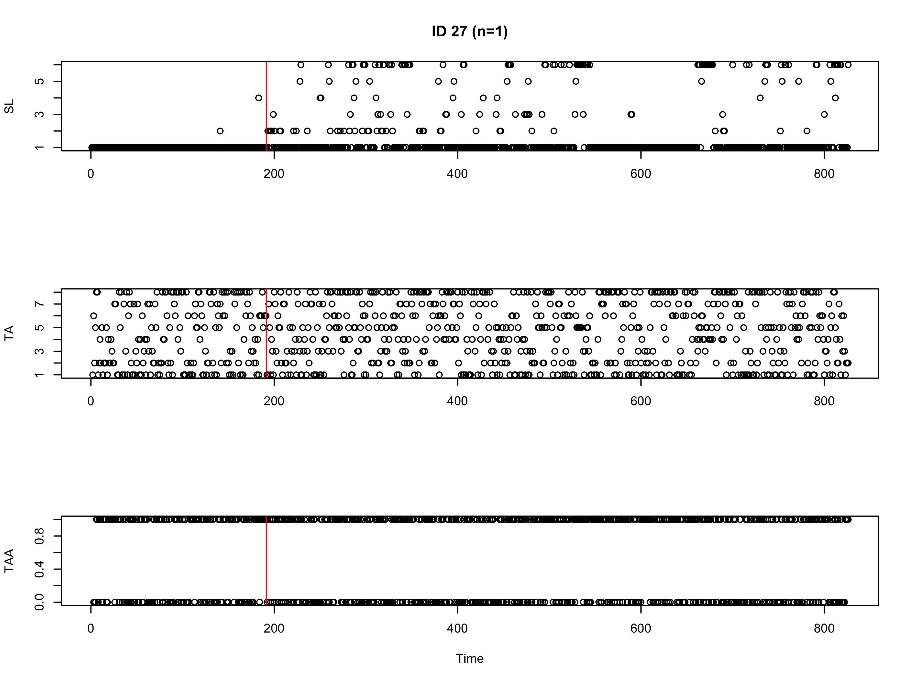
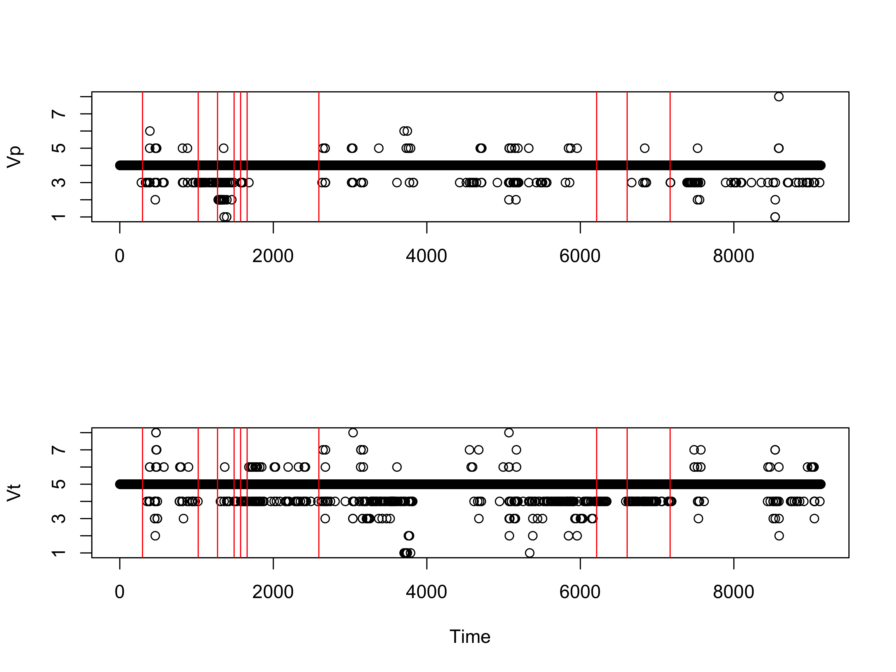
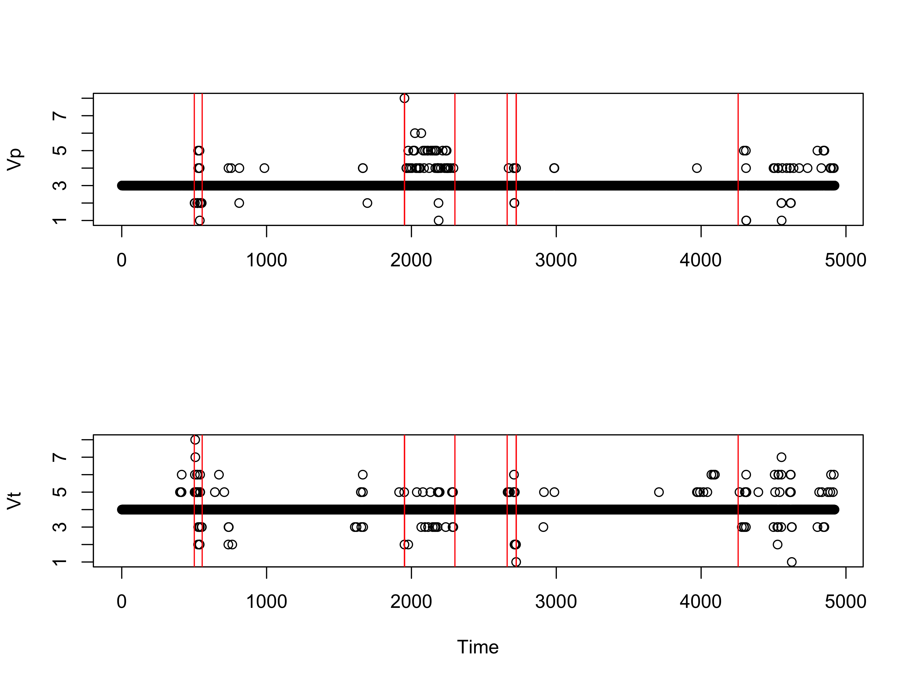
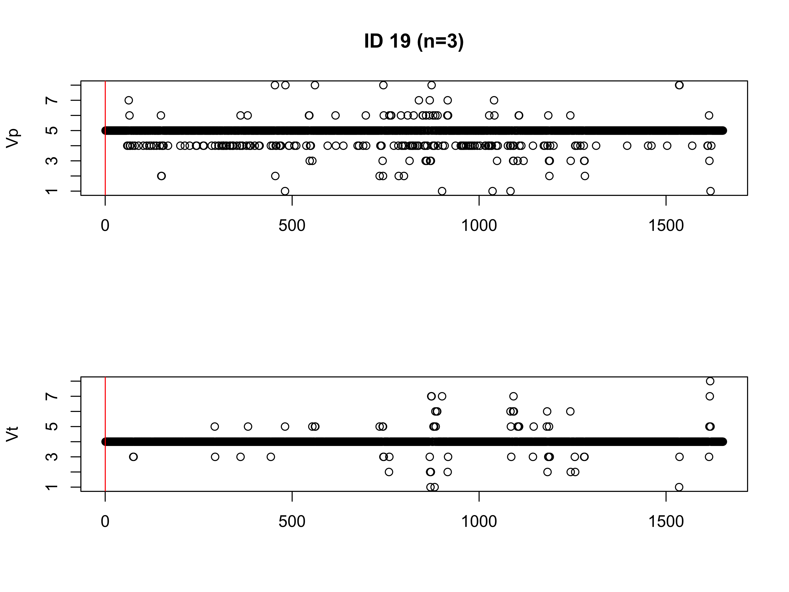
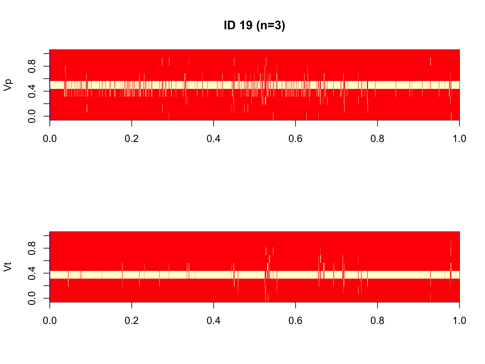
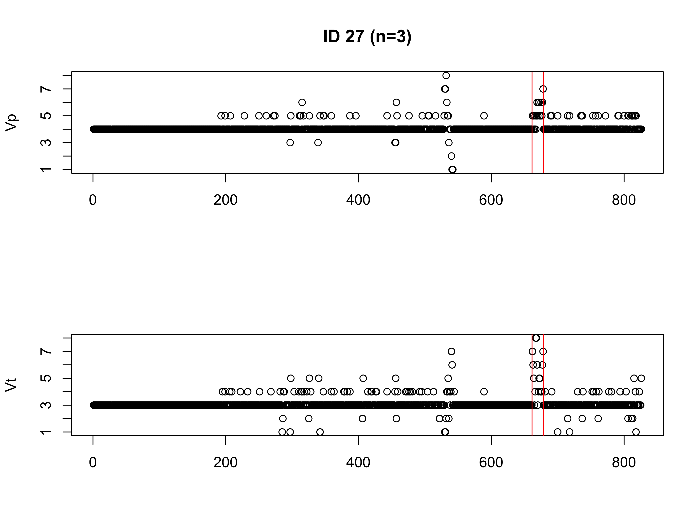
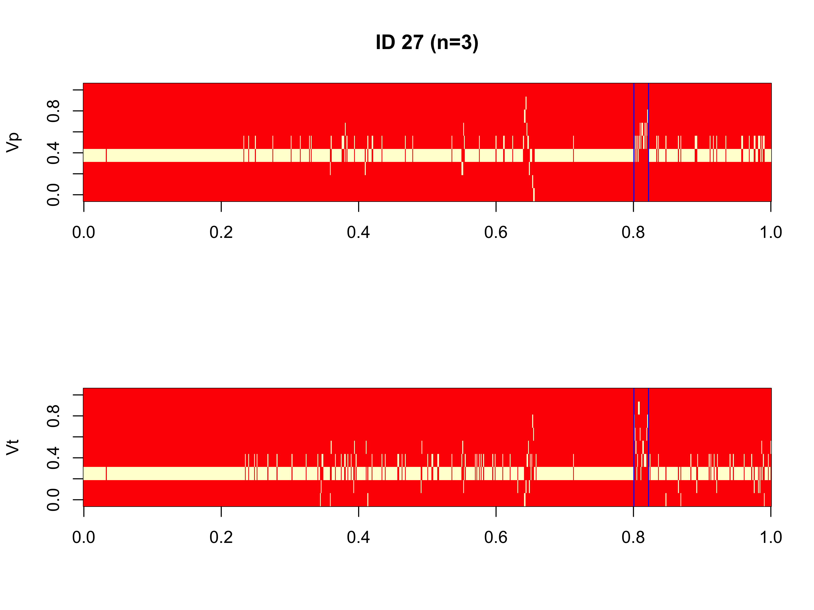

```{r setup, include=FALSE}
knitr::opts_chunk$set(echo = FALSE, warning = FALSE, message = FALSE)
```

# Background

After running the time segmentation model, a behavioral segmentation model was run for the entire dataset of each individual. The original behavior segmentation model uses three movement parameters (step length, turning angle, and turning angle autocorrelation) to identify distinct behavioral states. Since the output from this original model was not satisfactory upon visualization of the movement parameters and their associated breakpoints, other forms of this model were tested. While multiple derived variables were used in addition to the original parameters of the original model, a separate model that only used persistence and turning velocity (*V~p~* and *V~t~*) was included. These variables were inlcluded per their utility described in the behavioral change point analysis by Gurarie et al. (2009):

> "We further transform the data by decomposing every speed estimate and turning angle into orthogonal components of persistence velocity *V~p~(t)* and turning velocity *V~t~(t)* defined as $V_p(t) = V(t)cos(\theta(t))$ and $V_t(t) = V(t)sin(\theta(t))$, where *V(t)* is the speed and $\theta(t)$ is the turning angle at time *t*. *V~p~* captures the tendency and magnitude of a movement to persist in a given direction while *V~t~* captures the tendency of movement to head in a perpendicular direction in a given time interval. Thus, the primary descriptive features of movement, namely speed, directional persistence and variability are captured in these variables."


Additionally, the segmentation of behaviors was mapped to discern if the models characterized behavioral changes appropriately. This was conducted for each of the four individual snail kites. All models were analyzed on only data that were filtered for a time step of 1 h (3600 s); a quick analysis showed that a 1 h time step produces the greatest number of total observations.


# Original Model

All of the behavioral segmentation models analyzed with the original variables (SL,TA,TAA) were run using 50000 iterations. Additional model output (# of breakpoints, log marginal likelihood) was also evaluated with traceplots, but are not included in this document. Based upon the traceplots of these variables however, it appears that a greater number of iterations is likely not needed.

```{r, load packages}
library(knitr)
library(dplyr)
library(ggplot2)
library(rnaturalearth)
library(rnaturalearthdata)
library(sf)
```


### ID 1
```{r, out.width='80%'}

include_graphics("ID 1 behav seg image.png")
```

### ID 12
```{r, out.width='80%'}

include_graphics("ID 12 behav seg image.png")
```

### ID 19
```{r, out.width='80%'}

include_graphics("ID 19 behav seg image.png")
```

### ID 27
```{r, out.width='80%'}

include_graphics("ID 27 behav seg image.png")
```


# Velocity Model

As opposed to the original model that evaluated three movement parameters, two of which were estimated from a multinomial distribution (SL,TA) and one from a Bernoulli distribution (TAA), the velocty model only includes two variables that were both estimated from a multinomial distribution. Due to the traceplots of the breakpoints and LML not reaching a clear asymptote, the Gibbs samplers were run for 20000 iterations, but likely would need more to have converged properly.

### ID 1
```{r, out.width='80%'}

include_graphics("ID 1 behav seg image Vp_Vt.png")
```

### ID 12
```{r, out.width='80%'}

include_graphics("ID 12 behav seg image Vp_Vt.png")
```

### ID 19
```{r, out.width='80%'}


```

### ID 27
```{r, out.width='80%'}


```


# Mapping the Model Output

```{r}
dat<- read.csv("Snail Kite Gridded Data.csv", header = T, sep = ",")
names(dat)[7]<- "dist" #change to generic form

#discretize step length, turning angle, and turning angle autocorr by ID
dat1<- dat %>% filter(id==1)
dat12<- dat %>% filter(id==12)
dat19<- dat %>% filter(id==19)
dat27<- dat %>% filter(id==27)

dat1$time1<- 1:nrow(dat1)
dat12$time1<- 1:nrow(dat12)
dat19$time1<- 1:nrow(dat19)
dat27$time1<- 1:nrow(dat27)
```


### Original Model

Some of the following behavioral segments appear to match up well with movement patterns, while others appear to be aggregated. This also varies by individual and the duration of the track. For example, **ID 12** has 31 estimated behavioral segments, whereas **ID 27** only has 2.

```{r load map data}
#Load FL map data
usa <- ne_states(country = "United States of America", returnclass = "sf")
fl<- usa %>% filter(name == "Florida")
fl<- st_transform(fl, crs = "+init=epsg:32617") #change projection to UTM 17N
```

```{r behavior segmentation}
obs1.breakpts_orig<- read.csv("ID1 Breakpoints (Behavior).csv", header = T, sep = ",")
obs1.breakpts_orig=obs1.breakpts_orig[,1]
obs12.breakpts_orig<- read.csv("ID12 Breakpoints (Behavior).csv", header = T, sep = ",")
obs12.breakpts_orig=obs12.breakpts_orig[,1]
obs19.breakpts_orig<- read.csv("ID19 Breakpoints (Behavior).csv", header = T, sep = ",")
obs19.breakpts_orig=obs19.breakpts_orig[,1]
obs27.breakpts_orig<- read.csv("ID27 Breakpoints (Behavior).csv", header = T, sep = ",")
obs27.breakpts_orig=obs27.breakpts_orig[,1]


assign.behav.seg=function(breakpt,dat){
  breakpt1=c(0,breakpt,Inf)
  n=length(breakpt1)
  dat$behav.seg<- NA
  
  for (i in 2:n){
    ind=which(breakpt1[i-1]<dat$time1 & dat$time1<breakpt1[i])
    dat[ind,"behav.seg"]=i-1
  }
  dat
}


dat1<- assign.behav.seg(obs1.breakpts_orig, dat1)
dat12<- assign.behav.seg(obs12.breakpts_orig, dat12)
dat19<- assign.behav.seg(obs19.breakpts_orig, dat19)
dat27<- assign.behav.seg(obs27.breakpts_orig, dat27)
```


```{r map ID 1 orig, fig.align="center"}
ggplot() +
  geom_sf(data = fl) +
  coord_sf(xlim = c(min(dat$utmlong-20000), max(dat$utmlong+20000)),
           ylim = c(min(dat$utmlat-20000), max(dat$utmlat+20000)), expand = FALSE) +
  geom_path(data = dat1, aes(x=utmlong, y=utmlat), color="gray60", size=0.25) +
  geom_point(data = dat1, aes(utmlong, utmlat, color=behav.seg), size=1) +
  scale_color_viridis_c("Behavioral Segment") +
  labs(x = "Easting", y = "Northing", title = "ID 1 (n=26)") +
  theme_bw()
```

```{r map ID 1 orig facet, fig.align="center"}
ggplot() +
  geom_sf(data = fl) +
  coord_sf(xlim = c(min(dat$utmlong-20000), max(dat$utmlong+20000)),
           ylim = c(min(dat$utmlat-20000), max(dat$utmlat+20000)), expand = FALSE) +
  geom_path(data = dat1, aes(x=utmlong, y=utmlat), color="gray60", size=0.25) +
  geom_point(data = dat1, aes(utmlong, utmlat, color=behav.seg), size=1) +
  scale_color_viridis_c("Behavioral Segment") +
  labs(x = "Easting", y = "Northing", title = "ID 1 (n=26)") +
  theme_bw() +
  facet_wrap(~behav.seg, nrow = 4)
```


```{r map ID 12 orig, fig.align="center"}
ggplot() +
  geom_sf(data = fl) +
  coord_sf(xlim = c(min(dat$utmlong-20000), max(dat$utmlong+20000)),
           ylim = c(min(dat$utmlat-20000), max(dat$utmlat+20000)), expand = FALSE) +
  geom_path(data = dat12, aes(x=utmlong, y=utmlat), color="gray60", size=0.25) +
  geom_point(data = dat12, aes(utmlong, utmlat, color=behav.seg), size=1) +
  scale_color_viridis_c("Behavioral Segment") +
  labs(x = "Easting", y = "Northing", title = "ID 12 (n=31)") +
  theme_bw()
```

```{r map ID 12 orig facet, fig.align="center"}
ggplot() +
  geom_sf(data = fl) +
  coord_sf(xlim = c(min(dat$utmlong-20000), max(dat$utmlong+20000)),
           ylim = c(min(dat$utmlat-20000), max(dat$utmlat+20000)), expand = FALSE) +
  geom_path(data = dat12, aes(x=utmlong, y=utmlat), color="gray60", size=0.25) +
  geom_point(data = dat12, aes(utmlong, utmlat, color=behav.seg), size=1) +
  scale_color_viridis_c("Behavioral Segment") +
  labs(x = "Easting", y = "Northing", title = "ID 12 (n=31)") +
  theme_bw() +
  facet_wrap(~behav.seg, nrow = 5)
```


```{r map ID 19 orig, fig.align="center"}
ggplot() +
  geom_sf(data = fl) +
  coord_sf(xlim = c(min(dat$utmlong-20000), max(dat$utmlong+20000)),
           ylim = c(min(dat$utmlat-20000), max(dat$utmlat+20000)), expand = FALSE) +
  geom_path(data = dat19, aes(x=utmlong, y=utmlat), color="gray60", size=0.25) +
  geom_point(data = dat19, aes(utmlong, utmlat, color=behav.seg), size=1) +
  scale_color_viridis_c("Behavioral Segment") +
  labs(x = "Easting", y = "Northing", title = "ID 19 (n=5)") +
  theme_bw()
```

```{r map ID 19 orig facet, fig.align="center"}
ggplot() +
  geom_sf(data = fl) +
  coord_sf(xlim = c(min(dat$utmlong-20000), max(dat$utmlong+20000)),
           ylim = c(min(dat$utmlat-20000), max(dat$utmlat+20000)), expand = FALSE) +
  geom_path(data = dat19, aes(x=utmlong, y=utmlat), color="gray60", size=0.25) +
  geom_point(data = dat19, aes(utmlong, utmlat, color=behav.seg), size=1) +
  scale_color_viridis_c("Behavioral Segment") +
  labs(x = "Easting", y = "Northing", title = "ID 19 (n=5)") +
  theme_bw() +
  facet_wrap(~behav.seg, nrow = 1)
```


```{r map ID 27 orig, fig.align="center"}
ggplot() +
  geom_sf(data = fl) +
  coord_sf(xlim = c(min(dat$utmlong-20000), max(dat$utmlong+20000)),
           ylim = c(min(dat$utmlat-20000), max(dat$utmlat+20000)), expand = FALSE) +
  geom_path(data = dat27, aes(x=utmlong, y=utmlat), color="gray60", size=0.25) +
  geom_point(data = dat27, aes(utmlong, utmlat, color=behav.seg), size=1) +
  scale_color_viridis_c("Behavioral Segment") +
  labs(x = "Easting", y = "Northing", title = "ID 27 (n=2)") +
  theme_bw()
```

```{r map ID 27 orig facet, fig.align="center"}
ggplot() +
  geom_sf(data = fl) +
  coord_sf(xlim = c(min(dat$utmlong-20000), max(dat$utmlong+20000)),
           ylim = c(min(dat$utmlat-20000), max(dat$utmlat+20000)), expand = FALSE) +
  geom_path(data = dat27, aes(x=utmlong, y=utmlat), color="gray60", size=0.25) +
  geom_point(data = dat27, aes(utmlong, utmlat, color=behav.seg), size=1) +
  scale_color_viridis_c("Behavioral Segment") +
  labs(x = "Easting", y = "Northing", title = "ID 27 (n=2)") +
  theme_bw() +
  facet_wrap(~behav.seg, nrow = 1)
```


### Velocity Model

In general, this model estimated a greater number of behavioral segments than the original model, but not substantially more. There appears to be some agreement between both sets of breakpoints, but there appear to be more differences. These differences in segmentation occur with respect to whether certain foray loops or locations of intense use are separated out or grouped together.


```{r behavior segmentation veloc}
obs1.breakpts_veloc<- read.csv("ID1 Breakpoints (Behavior) Vp_Vt.csv", header = T, sep = ",")
obs1.breakpts_veloc=obs1.breakpts_veloc[,1]
obs12.breakpts_veloc<- read.csv("ID12 Breakpoints (Behavior) Vp_Vt.csv", header = T, sep = ",")
obs12.breakpts_veloc=obs12.breakpts_veloc[,1]
obs19.breakpts_veloc<- read.csv("ID19 Breakpoints (Behavior) Vp_Vt.csv", header = T, sep = ",")
obs19.breakpts_veloc=obs19.breakpts_veloc[,1]
obs27.breakpts_veloc<- read.csv("ID27 Breakpoints (Behavior) Vp_Vt.csv", header = T, sep = ",")
obs27.breakpts_veloc=obs27.breakpts_veloc[,1]

dat1<- assign.behav.seg(obs1.breakpts_veloc, dat1)
dat12<- assign.behav.seg(obs12.breakpts_veloc, dat12)
dat19<- assign.behav.seg(obs19.breakpts_veloc, dat19)
dat27<- assign.behav.seg(obs27.breakpts_veloc, dat27)
```


```{r map ID 1 veloc, fig.align="center"}
ggplot() +
  geom_sf(data = fl) +
  coord_sf(xlim = c(min(dat$utmlong-20000), max(dat$utmlong+20000)),
           ylim = c(min(dat$utmlat-20000), max(dat$utmlat+20000)), expand = FALSE) +
  geom_path(data = dat1, aes(x=utmlong, y=utmlat), color="gray60", size=0.25) +
  geom_point(data = dat1, aes(utmlong, utmlat, color=behav.seg), size=1) +
  scale_color_viridis_c("Behavioral Segment") +
  labs(x = "Easting", y = "Northing", title = "ID 1 (n=11)") +
  theme_bw()
```

```{r map ID 1 veloc facet, fig.align="center"}
ggplot() +
  geom_sf(data = fl) +
  coord_sf(xlim = c(min(dat$utmlong-20000), max(dat$utmlong+20000)),
           ylim = c(min(dat$utmlat-20000), max(dat$utmlat+20000)), expand = FALSE) +
  geom_path(data = dat1, aes(x=utmlong, y=utmlat), color="gray60", size=0.25) +
  geom_point(data = dat1, aes(utmlong, utmlat, color=behav.seg), size=1) +
  scale_color_viridis_c("Behavioral Segment") +
  labs(x = "Easting", y = "Northing", title = "ID 1 (n=11)") +
  theme_bw() +
  facet_wrap(~behav.seg, nrow = 3, ncol = 5)
```


```{r map ID 12 veloc, fig.align="center"}
ggplot() +
  geom_sf(data = fl) +
  coord_sf(xlim = c(min(dat$utmlong-20000), max(dat$utmlong+20000)),
           ylim = c(min(dat$utmlat-20000), max(dat$utmlat+20000)), expand = FALSE) +
  geom_path(data = dat12, aes(x=utmlong, y=utmlat), color="gray60", size=0.25) +
  geom_point(data = dat12, aes(utmlong, utmlat, color=behav.seg), size=1) +
  scale_color_viridis_c("Behavioral Segment") +
  labs(x = "Easting", y = "Northing", title = "ID 12 (n=10)") +
  theme_bw()
```

```{r map ID 12 veloc facet, fig.align="center"}
ggplot() +
  geom_sf(data = fl) +
  coord_sf(xlim = c(min(dat$utmlong-20000), max(dat$utmlong+20000)),
           ylim = c(min(dat$utmlat-20000), max(dat$utmlat+20000)), expand = FALSE) +
  geom_path(data = dat12, aes(x=utmlong, y=utmlat), color="gray60", size=0.25) +
  geom_point(data = dat12, aes(utmlong, utmlat, color=behav.seg), size=1) +
  scale_color_viridis_c("Behavioral Segment") +
  labs(x = "Easting", y = "Northing", title = "ID 12 (n=10)") +
  theme_bw() +
  facet_wrap(~behav.seg, nrow = 2)
```


```{r map ID 19 veloc, fig.align="center"}
ggplot() +
  geom_sf(data = fl) +
  coord_sf(xlim = c(min(dat$utmlong-20000), max(dat$utmlong+20000)),
           ylim = c(min(dat$utmlat-20000), max(dat$utmlat+20000)), expand = FALSE) +
  geom_path(data = dat19, aes(x=utmlong, y=utmlat), color="gray60", size=0.25) +
  geom_point(data = dat19, aes(utmlong, utmlat, color=behav.seg), size=1) +
  scale_color_viridis_c("Behavioral Segment") +
  labs(x = "Easting", y = "Northing", title = "ID 19 (n=4)") +
  theme_bw()
```

```{r map ID 19 veloc facet, fig.align="center"}
ggplot() +
  geom_sf(data = fl) +
  coord_sf(xlim = c(min(dat$utmlong-20000), max(dat$utmlong+20000)),
           ylim = c(min(dat$utmlat-20000), max(dat$utmlat+20000)), expand = FALSE) +
  geom_path(data = dat19, aes(x=utmlong, y=utmlat), color="gray60", size=0.25) +
  geom_point(data = dat19, aes(utmlong, utmlat, color=behav.seg), size=1) +
  scale_color_viridis_c("Behavioral Segment") +
  labs(x = "Easting", y = "Northing", title = "ID 19 (n=4)") +
  theme_bw() +
  facet_wrap(~behav.seg, nrow = 1)
```


```{r map ID 27 veloc, fig.align="center"}
ggplot() +
  geom_sf(data = fl) +
  coord_sf(xlim = c(min(dat$utmlong-20000), max(dat$utmlong+20000)),
           ylim = c(min(dat$utmlat-20000), max(dat$utmlat+20000)), expand = FALSE) +
  geom_path(data = dat27, aes(x=utmlong, y=utmlat), color="gray60", size=0.25) +
  geom_point(data = dat27, aes(utmlong, utmlat, color=behav.seg), size=1) +
  scale_color_viridis_c("Behavioral Segment") +
  labs(x = "Easting", y = "Northing", title = "ID 27 (n=2)") +
  theme_bw()
```

```{r map ID 27 veloc facet, fig.align="center"}
ggplot() +
  geom_sf(data = fl) +
  coord_sf(xlim = c(min(dat$utmlong-20000), max(dat$utmlong+20000)),
           ylim = c(min(dat$utmlat-20000), max(dat$utmlat+20000)), expand = FALSE) +
  geom_path(data = dat27, aes(x=utmlong, y=utmlat), color="gray60", size=0.25) +
  geom_point(data = dat27, aes(utmlong, utmlat, color=behav.seg), size=1) +
  scale_color_viridis_c("Behavioral Segment") +
  labs(x = "Easting", y = "Northing", title = "ID 27 (n=2)") +
  theme_bw() +
  facet_wrap(~behav.seg, nrow = 1)
```


### Breakpoint Comparison

For direct comparison, below is a printout of the breakpoints for each ID estimated from each model:

**ID 1**
```{r}
obs1.brk<- data.frame(Original=c(obs1.breakpts_orig,NA,NA,NA), Velocity=obs1.breakpts_veloc)

kable(obs1.brk)
```

**ID 12**
```{r}
obs12.brk<- data.frame(Original=c(obs12.breakpts_orig,NA,NA,NA,NA), Velocity=obs12.breakpts_veloc)

kable(obs12.brk)
```

**ID 19**
```{r}
obs19.brk<- data.frame(Original=c(obs19.breakpts_orig,NA), Velocity=obs19.breakpts_veloc)

kable(obs19.brk)
```

**ID 27**
```{r}
obs27.brk<- data.frame(Original=c(obs27.breakpts_orig), Velocity=obs27.breakpts_veloc)

kable(obs27.brk)
```